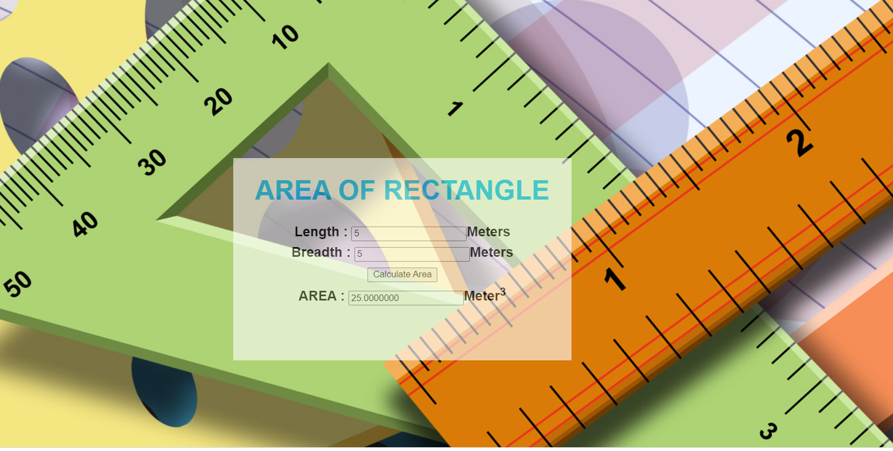

# Design a Website for Server Side Processing

## AIM:
To design a website to perform mathematical calculations in server side.

## DESIGN STEPS:
### Step 1:
Design your website for calculation using wireframe work.
### Step 2:
Then to execute the wireframe work design use html,css
### Step 3:
Use views.py to execute the coding in serverside.
### Step 4:
Mention the path of the website in urls.py.
### Step 5:
Publish the website in the given URL. : http://pranave21.student.saveetha.in/ 

## PROGRAM :

## Area.html
```
<!DOCTYPE html>
<html>
<head>
    <meta charset='utf-8'>
    <meta http-equiv='X-UA-Compatible' content='IE=edge'>
    <title>Math Calculation</title>
    <meta name='viewport' content='width=device-width, initial-scale=1'>
    <script src='main.js'></script>
    <style>
        * {
  box-sizing: border-box;
  font-family: Arial, Helvetica, sans-serif;
}
body {
  background-image: url("bg.jpg");
  width : fit-content
  height : fit-content
}

.container {
  width: 1080px;
  margin-left: auto;
  margin-right: auto;
  padding-top: 200px;
  padding-left: 300px;
  opacity: 0.6;
}
.content {
  display:block;
  width: 500px;
  min-height: 300px;
  font-size: 20px;
  background-color:white;
}
h1{
    color: deepskyblue;
    text-align: center;
    padding-top: 25px;
    font-weight: bolder;
}
.formelement{
    color: black;
    text-align: center;
    margin-top: 5px;
    margin-bottom: 5px;
    font-weight: bolder;
}
    </style>
</head>
<body>
    <div class="container">
    <div class="content">
    <h1>AREA OF RECTANGLE</h1>
    <form method="POST">
        
        <div class="formelement">
        Length : <input type="text" name="length" value=""></input>Meters<br/>
        </div>
        <div class="formelement">
        Breadth : <input type="text" name="breadth" value=""></input>Meters<br/>
        </div>
        
        <div class="formelement">
        <input type="submit"  value="Calculate Area"></input><br/>
        </div>
        <div class="formelement">
        AREA : <input type="text" name="volume" value=""></input>Meter<sup>3</sup><br/>
        </div>
    
    </form>
    </div>
    </div>
</body>
</html>
```
## views.py
```
from django.shortcuts import render


def volumecalculation(request):
    context={}
    context['l'] = "0"
    context['b'] = "0"
    context['area'] = "0"
    
    if request.method == 'POST':
        l = request.POST.get('length','0')
        b = request.POST.get('breadth','0')
        
        area = int(l) * int(b) 
        context['l'] = l
        context['b'] = b
        context['area'] = area

        
    return render(request,'area.html',context)
```

## urls.py
```

from django.contrib import admin
from django.urls import path
from mathapp import views

urlpatterns = [
    path('admin/', admin.site.urls),
    path('areaofrect/',views.areacalc,name="areaofrect"),
    path('',views.areacalc,name="areaofrect")]

```


## OUTPUT:


## Result:
A website to perform mathematical calculations in server side is created.